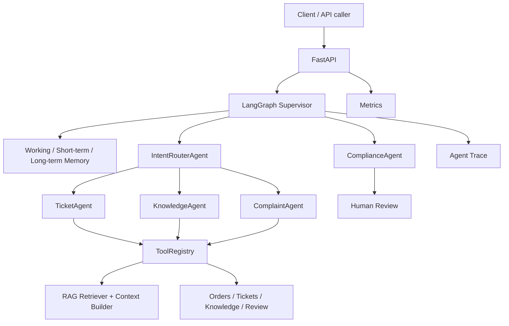

# Smart CS

Smart CS is a FastAPI + LangGraph customer-service agent project. It is built around a supervisor that routes user requests to specialized agents, calls business tools, retrieves knowledge with RAG, records trace data, and escalates risky or unresolved conversations to human review.

The project is designed as an interview-ready backend AI system: it is small enough to run locally, but already includes the core pieces expected in a production-style agent workflow.

## Features

- FastAPI service with auth, chat, ticket, order, tool, trace, review, and metrics endpoints.
- LangGraph `Supervisor` orchestration for intent routing and agent handoff.
- Specialized agents:
  - `TicketAgent` for refund, account, and ticket workflows.
  - `KnowledgeAgent` for knowledge-base Q&A.
  - `ComplaintAgent` for complaint intake and escalation.
  - `ComplianceAgent` for response safety checks.
- Tool Calling through `ToolRegistry`, including order lookup, ticket creation, refund eligibility, knowledge search, RAG context building, and human escalation.
- RAG pipeline with local embeddings, in-memory vector search, reranking, context building, and source attribution.
- Three-layer memory:
  - Working memory per request.
  - Short-term conversation memory.
  - Long-term user profile and conversation summary.
- Agent Trace for route, tool, final answer, compliance, and review steps.
- Human Review queue for complaints, low-confidence routes, compliance failures, explicit human requests, and high-value cases.
- Lightweight Evaluation module for end-to-end agent behavior checks.

## Architecture



## Project Layout

```text
app/
  agents/          Agent implementations
  evaluation/      Lightweight evaluation cases, runner, and metrics
  memory/          Working, short-term, and long-term memory
  RAG/             Retriever and RAG context utilities
  rag/             Vector store and embedding helpers
  tools/           ToolRegistry and concrete business tools
  main.py          FastAPI app and HTTP routes
  supervisor.py    LangGraph orchestration
tests/
  test_api_flow.py
  test_chat_flow.py
  test_evaluation.py
  test_rag.py
```

## Evaluation

Evaluation cases live in `app/evaluation/eval_cases.json`. The current suite covers:

- `refund_001`: refund request with order id.
- `refund_002`: refund request followed by order id in the second turn.
- `knowledge_001`: refund timing question with expected RAG source hit.
- `complaint_001`: complaint that should trigger human review.
- `trace_001`: refund flow with consistent trace id.

The runner reports:

- `intent_accuracy`
- `agent_route_accuracy`
- `tool_selection_accuracy`
- `rag_source_hit_rate`
- `human_review_trigger_accuracy`
- `trace_consistency_accuracy`
- `avg_latency_ms`

Run it with:

```bash
python -m app.evaluation.runner
```

The runner is compatible with minimal local environments. If optional runtime dependencies are missing, it falls back to a deterministic evaluation supervisor so the evaluation command can still execute.

## Local Setup

```bash
python -m venv .venv
pip install -r requirements.txt
uvicorn app.main:app --reload
```

Health check:

```bash
curl http://127.0.0.1:8000/health
```

## Tests

Core offline tests:

```bash
pytest -v tests/test_rag.py
pytest -v tests/test_chat_flow.py
pytest -v tests/test_evaluation.py
```

Full test suite:

```bash
pytest -v
```

API flow tests require a running server and are skipped by default:

```bash
RUN_API_FLOW_TESTS=1 pytest -v tests/test_api_flow.py
```

## API Surface

Main routes include:

- `GET /health`
- `POST /api/auth/register`
- `POST /api/auth/login`
- `POST /api/chat`
- `GET /api/orders`
- `POST /api/orders`
- `GET /api/tickets`
- `PATCH /api/tickets/{ticket_id}/status`
- `GET /api/tools`
- `POST /api/tools/execute`
- `GET /api/traces`
- `GET /api/admin/reviews`
- `GET /api/metrics`

## Roadmap

- MCP server-style tool endpoints under `app/mcp/`.
- Skill / Workflow layer:
  - `RefundSkill`
  - `ComplaintSkill`
  - `KnowledgeQASkill`
- Docker Compose for API, database, and cache.
- Expanded documentation for deployment, evaluation reports, and operational metrics.
